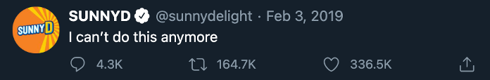
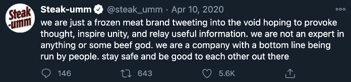
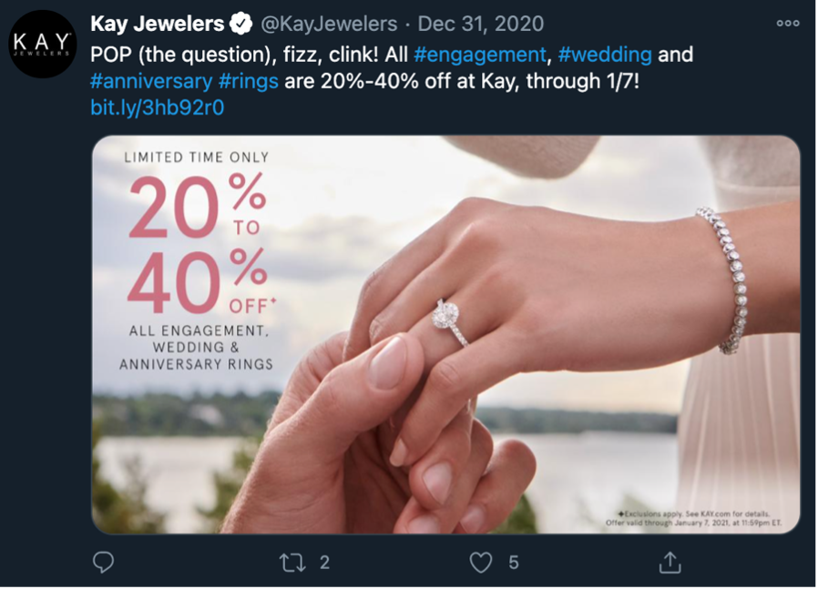
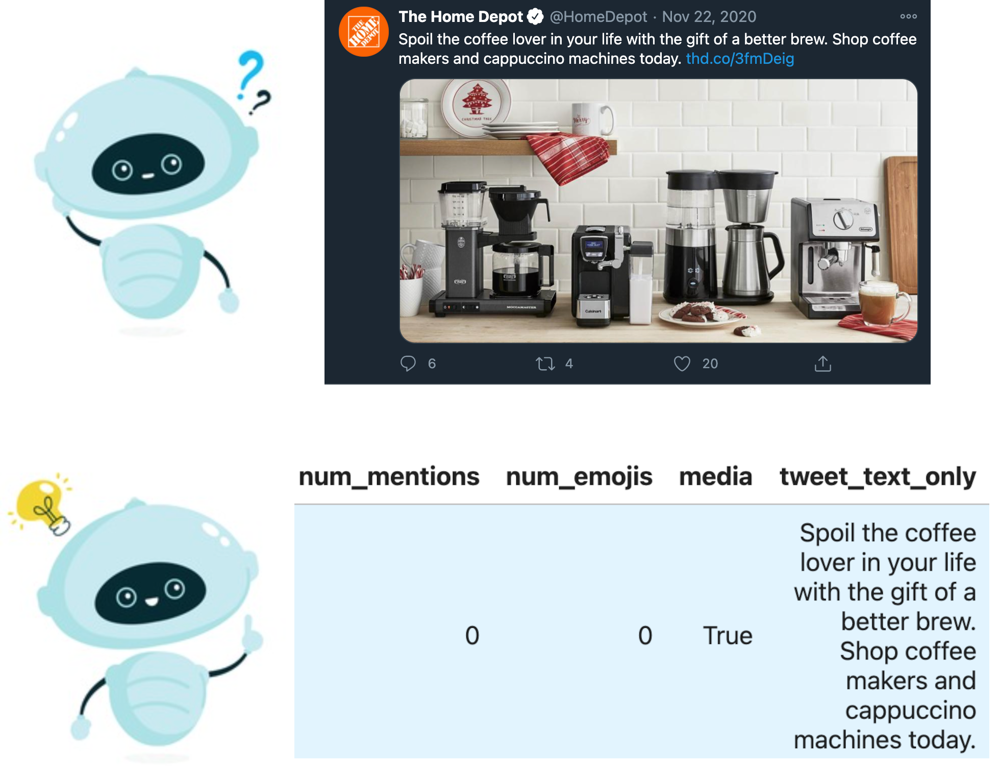
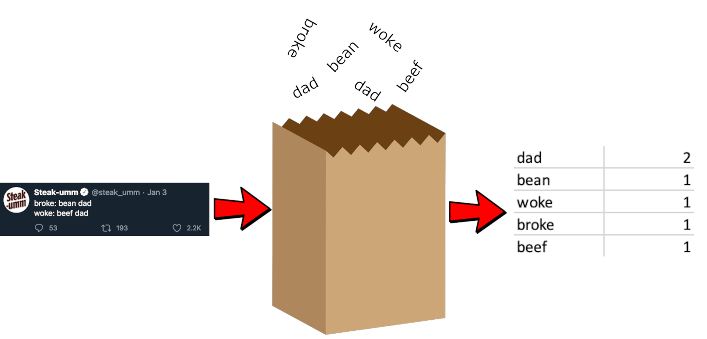
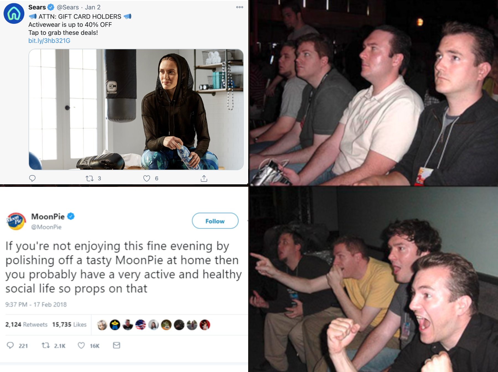

# Can Robots Recognize Humour? Building a Machine Learning Model to Identify Twitter Memes

## Marketing to a new generation

Social media is an effective way to market to modern consumers, with most brands now running Twitter and Instagram accounts. While early efforts to gain a following on these online platforms were very stiff, traditional, and not particularly effective, things have changed significantly in recent years. This is because brands have since cracked the code on how to present themselves in a way that effectively leads to high levels of online traction. That is to say, with a relatable, self-aware, and sharply humorous image.

An example of a "humours" tweet

In 2015 the official Denny's tumblr account was the first to [flood their page with trendy memes](https://pleated-jeans.com/2015/11/10/28-weirdly-wonderful-posts-from-the-dennys-tumblr-page/) and cake their language in the internet lingo of the younger generations. Today numerous brands take this this approach to running their Twitter, Instagram, and Facebook accounts. As it turns out, when *SunnyD* alludes to feelings of depression it strikes and cord with people and their posts gain considerably more traction.

An example of a "relatable" tweet.

An example of a "self-aware" tweet.

A bot that could identify whether a brand tweet is (for lack of a better term) a "meme tweet" meant to come across as "relatable" or "humorous" could aid significantly in marketing analysis. For example, such a model could be used in the process of examining the impact of different marketing strategies and guide the social media management of large corporations. I decided to build a prototype machine learning model that could do exactly this.

*Kay Jewellers* seem to keep their social media marketing conventional.

## Building a "meme-identifying model"

Since my model is indented to act as a prototype, I built it using a straightforward supervised learning approach. I scraped thousands of tweets from 20 different brands, those known for their memes and jokes (i.e. *Denny's*, *Wendy's*, *MoonPie*) and those which employ more traditional advertising (i.e. *Sears*, *Kay Jewelers*, *The Home Depot*). While replies are the source of many of the humorous tweets from these accounts (see [*Wendy's*](https://www.boredpanda.com/funny-wendy-tweets-jokes/?utm_source=google&utm_medium=organic&utm_campaign=organic)) charting the relationship of multiple tweets is outside the scope of this project and they have been omitted from the training and test datasets.

In order to teach the model what a "meme" is I classified 500 tweets as "meme" or "not meme" by hand for the model to learn from. Additionally, I needed to make sure my collection of tweets was easily readable by a computer. This was done by boiling a tweet down to a handful of datapoints and storing them in a spreadsheet. After the model was trained to recognize what "meme" is it could be deployed on a larger dataset of tweets and make its best guess of assigning them to one category or the other.

Each needs to be broken up into a handful of different factors to be interpretable to a machine learning model.

I used simple language processing techniques to boil down aspects of a tweet's text to simple numbers like number of characters, emojis, hashtags, and other user mentions. The wording of each tweet was also examined with a "bag of words" approach, which means that the model was trained to look for the presence of specific words. I also examined the number of grammatical mistakes present per number of words in each tweet (using [LanguageTool](https://pypi.org/project/language-tool-python/)) and generated a sentimentality score to indicating how positive or negative each tweet was (using [VADER-Sentiment-Analysis](https://github.com/cjhutto/vaderSentiment)).

An example of a "bag-of-words" approach to interpreting language. Text is broken down into the frequency of which words are used to turn writing into numeric data.

I also provided the model with some of Twitter's metadata. Since some of the worst performing tweets from an account like McDonalds (with 3.7 million followers) will almost always perform better than the best performing tweets from an account like Quiznoes (with 125k followers), I scaled the number of likes and retweets each tweet received to be proportional to the account average. All tweets used in the model were at least 24 hours old to ensure they had enough time to run through the natural social media cycle. The model was also made aware if any images or videos were attached to a tweet but I did not have it look at them (this would be a project of its own). I explicitly made sure not to tell the model which brand each tweet came from to keep it from thinking that a tweet *must* come from one of the brands I trained it on to be considered a meme.

## Taking the model for a spin

I used a random forest classifier to build a model that classifies each tweet by running them through a collection of decision trees. After tuning some numbers to adjust how the model is built, it's "true precision" (how often the model is able to identify a "meme" when presented with one) was 76%. Not bad considering how subjective identifying humour can be but not phenomenal either. This number will likely go up if I train the model with more data (the true precision is 57% when run on 200 tweets) though that would unfortunately require classifying hundreds of additional tweets by hand.

Worth additional note is that there is an obvious level of subjectivity as to what "meme" is. I tried to keep my classifications consistent but it's undeniable that my personal biases crept in. I have essentially trained the model to identify what *I* personally recognize as a "meme" meaning the model acts as an emulation of my observations. Imagine, for example, training a model on the decisions of a world leader or CEO to keep a version of them around after they've passed away.

## Examining what the model learned

After the model was complete, I examined which words in the body text of tweets it considered most important in the classification process. Words that are strongly indicative of a tweet *not being* a meme include "you", "yours", "flight", "peek", "complain", "weeks" and "know". Words strongly indicative a tweet *being* a meme include "telling", "yum", "synthetic", "leave", "poppin", "why", "taking" and "got". Here we can see the effects of training the model on a small dataset 500 tweets from 20 different brands. For example, most of my "meme" examples come from companies selling fast or prepackaged food while many of my non-meme examples are selling expensive products like apparel and airline tickets. This means the model was trained to think that food-related words are associated with "memes", meaning for example, it might think tweets from *Morton's The Steakhouse* are much trendier than they actually are. This is why words like "flight" and "yum" are seen as so important to the current version of the model.

Looking at the features not related to wording we see the strongest indicator of a meme tweet is a high proportion of retweets and likes compared to the account average, with retweets being the more important of the two. The most indicative features of a tweet *not* being a meme are mentioning other users, using emojis, and writing longer tweets. Other features I generated appear to have minimal significance in classifying tweets one way or the other.

## Assessing the model's performance

An *unsupervised* learning approach would have likely be a more effective alternative to the *supervised* learning methods I used. A model built this way would not need to be provided with examples of what is and isn't a meme tweet and would instead need to discover this for itself. The downsides to this approach are that it would be considerably more complicated (meaning it would take longer to build) and that it might end up with some weird ideas as to what it thinks a meme is. The positives of this approach would be that a model could be trained on thousands of tweets without the need to manually classify them beforehand. Also, since humour trends are always changing, it would be easy to keep the model current since it could automatically update itself. A more robust model could also implement some form of image processing to identify trends in photos, videos, and gifs attached to tweets.

As it stands, the model I was able to build through supervised learning works considerably better than I would have initially thought. I would never expect a model assessing tweets to achieve near flawless classification accuracy (i.e. 99%) due to how abstract the barriers between "meme" and "not meme" are, but being accurate three quarters of the time is probably better than my mom or dad could do. Even with the model in its current form there are a handful interesting insights to be gleaned as to what goes into writing a trendy tweet. For example, many might think that the use of emojis would make your tweets come across as more "memey" when in reality the opposite is true. It also seems like using direct words such as "you" and "your" makes advertising come across as more conventional. Additionally, the model shows that it is possible to for a machine to identify something as emotionally complex as humour and acts as a nice proof-of-concept for what could be a more complex and robust "meme identifying" model.
